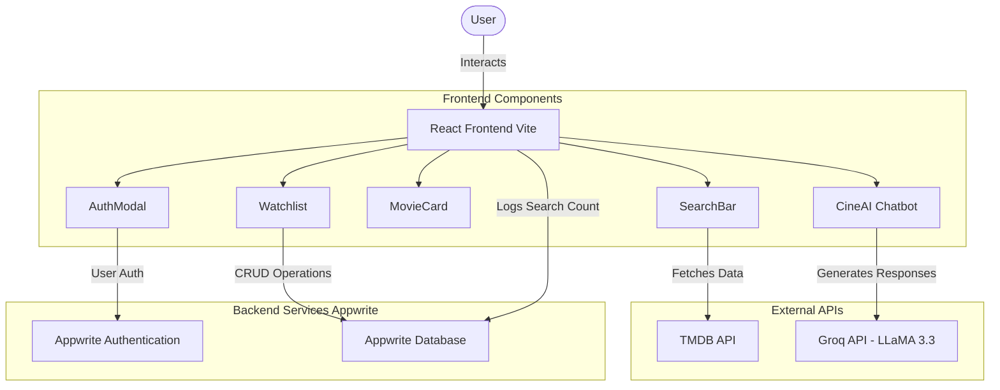
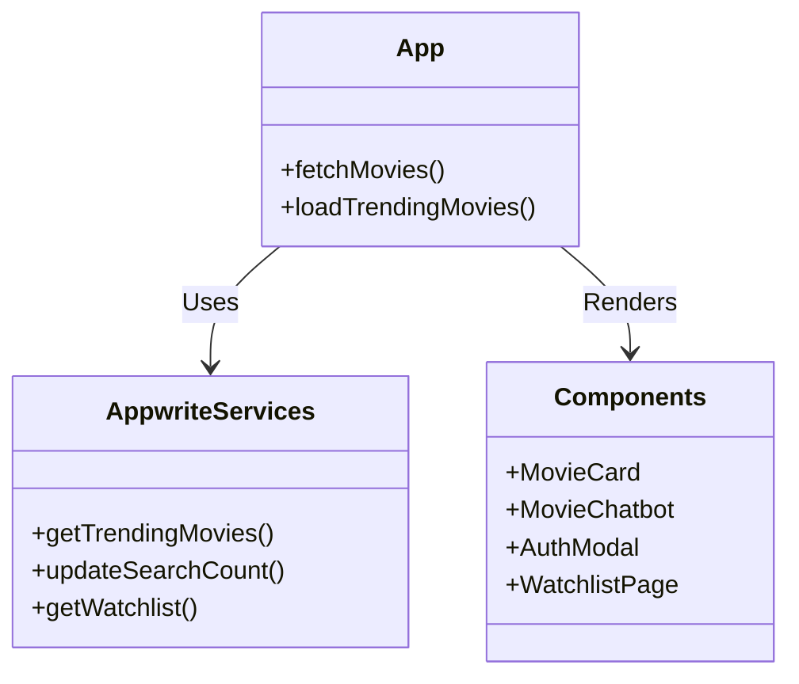

# 🎬 CineSearch - Movie Discovery Platform


CineSearch is a modern, feature-rich movie discovery application designed to help you find your next favorite film. It features advanced search, trending movies, user authentication, personal watchlists, movie reviews, and an AI-powered movie expert chatbot to guide your cinematic journey!

---

## 🌟 Key Features

- **🔍 Smart Movie Search:** Search through thousands of movies using the TMDB API.
- **📈 Trending Movies:** See what's popular globally right now based on user searches.
- **🔐 User Authentication:** Secure sign up and login powered by Appwrite.
- **📌 Personal Watchlist:** Save movies you want to watch later to your own personalized list.
- **📝 Movie Reviews:** Write and read reviews for your favorite movies.
- **🤖 CineAI Chatbot:** An intelligent LLaMA-3 powered chatbot (via Groq) to suggest movies, answer trivia, and discuss films!
- **🎨 Modern UI:** Sleek, responsive design built with Tailwind CSS.

---

## 🏗️ Architecture & Data Flow



---

## 🚀 Tech Stack

- **Frontend:** React 19, Vite, Tailwind CSS 4
- **Backend/BaaS:** Appwrite (Auth & Databases)
- **AI Models:** Groq API (LLaMA 3.3 70B Versatile)
- **Movie Data:** The Movie Database (TMDB) API

---

## 🛠️ Setup & Installation

Follow these steps to run the project locally.

### 1. Clone the repository
```bash
git clone https://github.com/Sid-LD/CineSearch-Movie-Discovery-platform.git
cd CineSearch-Movie-Discovery-platform/react
```

### 2. Install dependencies
```bash
npm install
```

### 3. Configure Environment Variables
Create a `.env.local` file in the root of your `react` folder and add the following keys:

```env
# TMDB API Key for movie data
VITE_TMDB_API_KEY=your_tmdb_api_key

# Appwrite Configuration
VITE_APPWRITE_PROJECT_ID=your_appwrite_project_id
VITE_APPWRITE_DATABASE_ID=your_appwrite_database_id
VITE_APPWRITE_COLLECTION_ID=your_search_metrics_collection_id
VITE_APPWRITE_WATCHLIST_COLLECTION_ID=your_watchlist_collection_id
VITE_APPWRITE_REVIEWS_COLLECTION_ID=your_reviews_collection_id

# Groq API for AI Chatbot
VITE_GROQ_API_KEY=your_groq_api_key
```

### 4. Run the development server
```bash
npm run dev
```
The application will be available at `http://localhost:5173`.

---

## 📂 Project Structure



---

## 🤝 Contributing

Contributions are always welcome! Feel free to open issues or submit pull requests.

1. Fork the Project
2. Create your Feature Branch (`git checkout -b feature/AmazingFeature`)
3. Commit your Changes (`git commit -m 'Add some AmazingFeature'`)
4. Push to the Branch (`git push origin feature/AmazingFeature`)
5. Open a Pull Request

---

## 📜 License

This project is open-source and available under the [MIT License](LICENSE).
